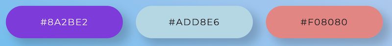
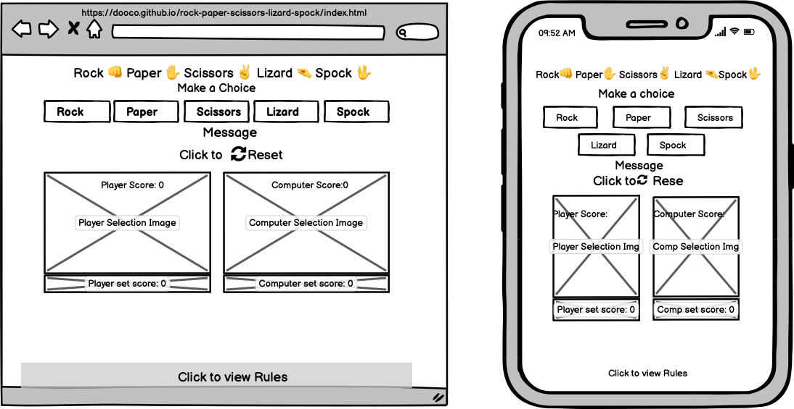
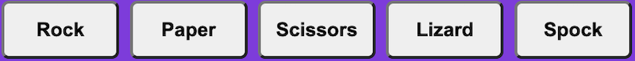
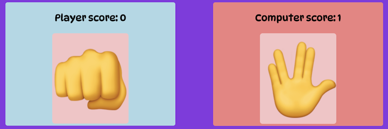
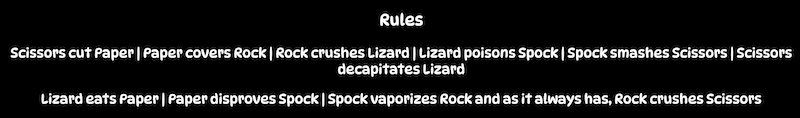
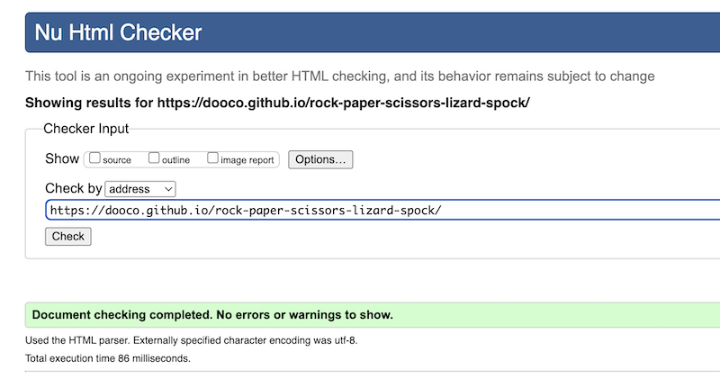
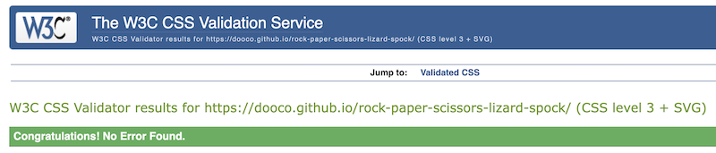
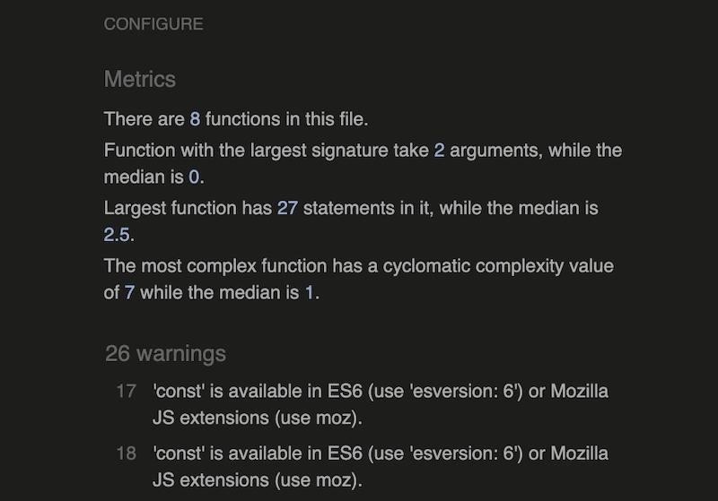

View the live project: Rock Paper Scissors Lizard Spock [here](https://dooco.github.io/rock-paper-scissors-lizard-spock/)

# Rock, Paper, Scissors, Lizard, Spock

This website forms part assignment for the Code Institute’s Full Stack Developer course - personal portfolio two. Using principles of javaScript learned on the javaScript essentials module this website was developed to demonstrate students knowledge and ability to implement javaScript code in a simple game.
As well as displaying competence in writing code in javaScript the website is designed using principles of user experience design, html and css to be responsive.

# User Experience (UX)

## Strategy Plane

Website was created to showcase knowledge of HTML, CSS and JavaScript and to provide users with some fun in the form of an online Rock, Paper, Scissors, Lizard, Spock game created with JavaScript.

## User stories

### First Time Visitor Goals

1. As a First Time Visitor, I want to easily understand the main purpose of the game.
2. As a First Time Visitor, I want to be able to easily navigate the site to play the game.
3. As a First Time Visitor, I want to be able to play game on any device.

### Returning Visitor Goals

1. As a Returning Visitor, I want to be able to play game at ease.
2. As a Returning Visitor, I want to compete with computer in simple game of chance.
3. As a Returning Visitor, I want to familiarise myself with rules of the game.

### Frequent User Goals

1. As a Frequent User, I want to continue to enjoy the game and share with family and friends.
2. As a Frequent User, I want to see if I can win against the computer.
3. As a Frequent User, I want to be able to reset game and start a new game.

# Design

## Colour Scheme

The three main colours used in the game are: blueviolet (used as background colour), lightblue (Player background colour) and lightcoral (computer background colour) inspired by the Code Institute’s case study video. Colour pallet was created by tool on mycolor.space website.

## Typography

The DynaPuff font is the main font used throughout the website with cursive as the fallback font in case for any reason the font isn't being imported into the site correctly. DynaPuff is a quirky font used frequently in children's games / websites.

### Imagery

Simple emoji characters are used to represent the elements of the game. The heading of the game consists of the elements in text, followed by the emoji for that element.

The game section of the site simply displays five buttons with text to identify the elements that the player can choose from. 

Two display areas display player choice and score and the other display area the computer choice and score. Again simple enlarged emoji representing the player choice and computer choice are displayed in their respective display areas.

### Wireframes

Game Page Wireframe 

# Features

Responsive on all device sizes. 

## Structure

### Header

The header consists of the five elements of the game in text, followed by the emoji for that element. It introduces the player to the game via simple element / image association.

### Player Selection 

Five buttons with text description for player to make their chioce for next itteration of game. When user’s mouse hovered over button the button animation (expands to 120%) highlighting which button is selected.

### Message and Reset Game

Message area displays information to the user such as 'New Game', 'Player Wins', Player Looses', It's a Tie'. Below this the player is given the option to 'Reset' the game.

### Player and Computer Image Selection and Score

The two display areas display player and computer choice and score. After game starts or reset both scores start at zero and increment as play progresses with logic operators in javaScript functions of game deciding which score should be incremented. Enlarged emoji images representing the player choice and computer choice are displayed in their respective display areas.

### Footer (Rules)

The game Rock, Paper, Scissors, Lizard, Spock is an extension of the  Rock, Paper, Scissors game as engineered by Sheldon in the Big Bang television series. The rules are displayed in the fixed footer area of the game, allowing player to familiarise themselves to the rules.

## Technologies Used

### Languages Used

1. HTML5
2. CSS3
3. JavaScript

### Frameworks, Libraries & Programs Used

- Hover.css:
Hover.css was used on the Player selection buttons in the player choice selection area to enlarge button while being hovered over.
- Google Fonts:
Google fonts were used to import the 'DynaPuff' font into the header section of index.html which is used throughout the project by referencing font family in style.css file.
- Font Awesome:
Font Awesome was used in the game to add an icon for game reset.
- Git:
Git was used for version control by utilizing the Gitpod terminal to commit to Git and Push to GitHub.
- GitHub:
GitHub is used to store the projects code after being pushed from Git.
- VS Code:
Integrated Development Environment used to develop the website.

- Balsamiq:
Balsamiq was used to create the wireframes during the design process.

- Code Institute's Student template for gitpod:
Preinstalled tools for students to use and create projects.

- Google Chrome Developer Tool:
Used to test and debug site. 

-  mycolor.space: 
Used to create colour pallet.

## Testing

The W3C Markup Validator and W3C CSS Validator Services were used to validate every page of the project to ensure there were no syntax errors in the project.

W3C Markup Validator - Results

W3C CSS Validator - Results

JavaScript code was tested by passing code through jshint.com

19 warnings

Warnings predominantly relate to variables and their interaction with different version of browsers and are not significant.

No errors were noted.

### Testing User Stories from User Experience (UX) Section

### Further Testing

The Website was tested on Google Chrome, Internet Explorer, Microsoft Edge and Safari browsers.
The website was viewed on a variety of devices such as Desktop, Laptop, iPhone7, iPhone 8 & iPhoneX.
A large amount of testing was done to ensure that all components of game, html, css and JavaScript linking correctly.
Friends and family members were asked to review the site and point out any bugs or issues.

## Known Bugs

On some mobile devices the Hero Image pushes the size of screen out more than any of the other content on the page.
A white gap can be seen to the right of the footer and navigation bar as a result.
On Microsoft Edge and Internet Explorer Browsers, all links in Navbar are pushed upwards when hovering over them.
# Deployment
## GitHub Pages
The project was deployed to GitHub Pages using the following steps...

Log in to GitHub and locate the GitHub Repository
At the top of the Repository (not top of page), locate the "Settings" Button on the menu.
Scroll down the Settings page until you locate the "GitHub Pages" Section.
Under "Source", click the dropdown called "None" and select "Master Branch".
The page will automatically refresh.
Scroll back down through the page to locate the now published site link in the "GitHub Pages" section.

# Credits

## Code

The Code Institute's Portfolio Project 2 Scope video provided the underling html, css and javaScript code for the game. This was modified and expanded to fit five elements of game Rock, Paper, Scissors, Lizard, Spock.

After researching various strategies to implement rules of game through JavaScript a solution was found on stack overflow.

Hash table: [JavaScript hash table:](https://stackoverflow.com/questions/22623331/rock-paper-scissors-lizard-spock-in-javaScript)

## Content

All content was written by the developer.

## Media

All Images were created by the developer.

## Acknowledgements

My Mentor for continuous helpful feedback.

Tutor support at Code Institute for their support.

