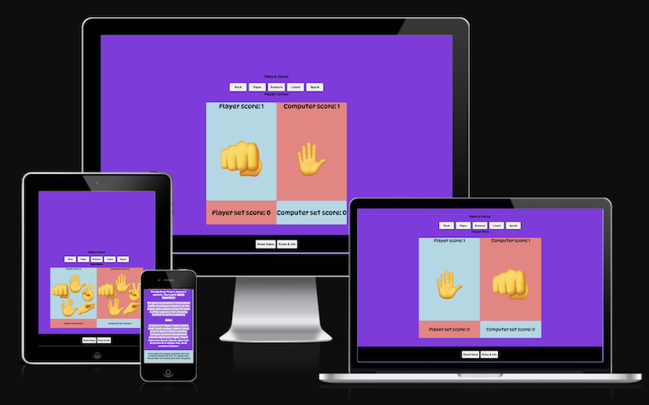

# Table of Contents

  * [Rock, Paper, Scissors, Lizard, Spock](#rock--paper--scissors--lizard--spock)
  * [User Experience (UX)](#user-experience--ux-)
  * [Strategy Plane](#strategy-plane)
  * [User stories](#user-stories)
    + [First Time Visitor Goals](#first-time-visitor-goals)
    + [Returning Visitor Goals](#returning-visitor-goals)
    + [Frequent User Goals](#frequent-user-goals)
- [Design](#design)
  * [Colour Scheme](#colour-scheme)
  * [Typography](#typography)
    + [Imagery](#imagery)
    + [Wireframes](#wireframes)
  
- [Features](#features)
  * [Structure](#structure)
    + [Player Selection](#player-selection)
    + [Message](#message)
    + [Player and Computer Image Selection and Score](#player-and-computer-image-selection-and-score)
    + [Footer](#footer)
  * [Technologies Used](#technologies-used)
    + [Languages Used](#languages-used)
    + [Frameworks, Libraries & Programs Used](#frameworks--libraries---programs-used)
  * [Testing](#testing)
    + [Game Logic Test](#game-logic-test)
    + [Testing code integrity](#testing-code-integrity)
    + [Further Testing](#further-testing)
  * [Known Bugs](#known-bugs)
  * [Limitations and further improvements](#limitations-and-further-improvements)
- [Deployment](#deployment)
  * [Deploying site](#deploying-site)
  * [Forking the GitHub Repository](#forking-the-github-repository)
- [Credits](#credits)
  * [Code](#code)
  * [Content](#content)
  * [Media](#media)
  * [Acknowledgements](#acknowledgements)

<small><i><a href='http://ecotrust-canada.github.io/markdown-toc/'>Table of contents generated with markdown-toc</a></i></small>

# Rock, Paper, Scissors, Lizard, Spock

View the live project: Rock Paper Scissors Lizard Spock [here](https://dooco.github.io/rock-paper-scissors-lizard-spock/)

This website forms part assignment for the Code Institute’s Full Stack Developer course - personal portfolio two. Using principles of javaScript learned on the javaScript essentials and 'Love Maths' walkthrough modules this website was developed to demonstrate students knowledge and ability to implement javaScript code in a simple game.
As well as displaying competence in writing code in javaScript the website is designed using principles of user experience design, html and css, and is designed to be responsive using basic css.
The game Rock, Paper, Scissors, Lizard, Spock is an extension of the Rock, Paper, Scissors game and is credited to Sheldon of the Big Bang television series.
---

# User Experience (UX)

## Strategy Plane

Website was created to showcase knowledge of HTML, CSS and JavaScript and to provide users with some fun in the form of an online Rock, Paper, Scissors, Lizard, Spock game created with JavaScript.

## User stories

### First Time Visitor Goals

1. As a First Time Visitor, I want to easily understand the main purpose of the game.
2. As a First Time Visitor, I want to be able to easily navigate the site to play the game.
3. As a First Time Visitor, I want to be able to play game on any device.

### Returning Visitor Goals

1. As a Returning Visitor, I want to be able to play game at ease.
2. As a Returning Visitor, I want to compete with computer in simple game of chance.
3. As a Returning Visitor, I want to familiarise myself with rules of the game.

### Frequent User Goals

1. As a Frequent User, I want to continue to enjoy the game and share with family and friends.
2. As a Frequent User, I want to see if I can win against the computer.
3. As a Frequent User, I want to be able to reset game and start a new game.

# Design

## Colour Scheme

The three main colours used in the game are: blueviolet (used as background colour), lightblue (Player background colour) and lightcoral (computer background colour) inspired by the Code Institute’s case study video. Colour pallet was created by tool on mycolor.space website.

## Typography

The 'DynaPuff' font is the main font used throughout the website with 'cursive' as the fallback font in case for any reason the font isn't being imported into the site correctly. DynaPuff is a quirky font used frequently in children's games / websites.

### Imagery

Simple emoji characters are used to represent the elements of the game. 

The game section of the site simply displays five buttons with text to identify the elements that the player can choose from. 

Two display areas displays player choice and score and the other display area the computer choice and score. Again simple enlarged emoji images representing the player choice and computer choice are displayed in their respective display areas.

### Wireframes

Game Page Wireframe 

---

# Features

An attempt to avoid excessive use of media queries led to the use of one media query that changed the display area from 80% of the game area container to 100% of the container at 580 pixels. This was necessary for smaller device screens as the images were spilling over and distorting the user experience.  Responsiveness was maintained on devices just below 300 pixels and smaller than this does result in distortion of the display area images. 

## Structure

### Player Selection 

Five buttons with text description for player to make their chioce for next itteration of game. When user’s mouse hovered over button the button animation (expands to 120%) highlighting which button is selected.

### Message

Message area displays information to the user such as 'New Game', 'Player Wins', Player Looses', It's a Tie'. 

### Player and Computer Image Selection and Score

The two display areas display player and computer choice and score. After game starts or reset both scores start at zero and increment as play progresses with logic operators in javaScript functions, as per rules of game, deciding which score should be incremented (or not if its a tie). Enlarged emoji images representing the player choice and computer choice are displayed in their respective display areas. After either player reached a score of 7 then that player wins the set and set score is registered under emoji image. Game scores are reset to zero and the game proceeds until either player reaches 7 again and set score is updated and new game starts. The first to 5 sets wins the match and reaches game over - a smily or sad face emoji is displayed in both player and computer display areas to reflect if player wins or loses.

### Footer 

The Reset Game button in the footer is used to reset the game at any stage during play. When game completed (when player wins or loses game) the Reset Game must be pressed to initiate a new game. 

The rules of the game need to be available to player but take up a lot of screen space on smaller devices. To view rules, click on  'Rules & Info' button in footer and rules will appear in a popup which can be collapsed again by clicking x. As well as the individual rules that decide a player/computer itteration the popup gives a brief description on where the game originated and charactoristic of this game where first to seven games wins the set and the first to win five sets wins the match.
On loading the game for the first time the rules model starts up 2 seconds after page is fully loaded. This function is initiated to alert player to rules of the game. The rules can be collapsed by clicking on x in modal.

---

## Technologies Used

### Languages Used

1. HTML5
2. CSS3
3. JavaScript

### Frameworks, Libraries & Programs Used

- Hover.css:
Hover.css was used on the Player selection buttons in the player choice selection area to enlarge button while being hovered over.

- Google Fonts:
Google fonts were used to import the 'DynaPuff' font into the header section of index.html which is used throughout the project by referencing font family in style.css file.

- Git:
Git was used for version control by utilizing the Gitpod terminal to commit to Git and Push to GitHub.

- GitHub:
GitHub is used to store the projects code after being pushed from Git.

- VS Code:
Integrated Development Environment used to develop the website.

- Balsamiq:
Balsamiq was used to create the wireframes during the design process.

- Code Institute's Student template for gitpod:
Preinstalled tools for students to use and create projects.

- Google Chrome Developer Tool:
Used to test and debug site. 

-  mycolor.space: 
Used to create colour pallet.

- Canva graphic designer platform
Used to remove background on images and resize images.

- favicon.io
Favicon generator used to generate favicon for game. 

- Markdown Table of Contents
Table of contents generated: https://ecotrust-canada.github.io/markdown-toc
---

## Testing

### Game Logic Test

Testing to maintain integrity of game rules entailed testing player’s five selections against the computer’s selections. As user controls players choice the test is conducted by moving through the five game elements and observing outcome compared to computer’s choice. As the computer’s choice is random testing has to run through as many iterations of the game so that all five game elements are tested against player’s choice. 
After completing the test for first player game element (rock) then testing proceeds to second player game element (paper) to that of computer’s random choice and continues until all five of player’s game choice elements are compared to that of computer’s five game elements. 
As can be seen from the chart below there are 25 possible outcomes and applying rules of game (column two) the outcomes proved true for each test. 

### Testing code integrity

The W3C Markup Validator and W3C CSS Validator services were used to validate the project to ensure there were no syntax errors. The jshint JavaScript test utility was uses to check for jacaScript errors in the project. The results are shown below.  

- W3C Markup Validator - Results

Validator indicated that no errors were observed.

- W3C CSS Validator - Results

Validator indicated that no errors were observed.

- JavaScript code was passed through jshint.com evaluation tool.

- There were 26 warnings predominantly related to variables and their interaction with different version of browsers and are not significant.

No errors were noted.

- Lighthouse analysis

Lighthouse analysis scores quality in five categories; performance, best practice, SEO and qualification as a Progressive Web Application. The analysis was performed on the website on an incognito browser window (as suggested by Lighthouse) for bot mobile and desktop. 

Lighthouse mobile results:

Lighthouse desktop results:

### Further Testing

- The Website was tested on Google Chrome, Firefox Developer and Safari browsers. Game worked as expected with media query expanding screen to 100% at 580 pixels. Screen integrity remains until it goes below 300 pixels when there is overflow in display area.

- The website was viewed on a variety of devices such as Desktop, Laptop, iPhone7 and iPhoneX.

- A large amount of testing was done during coding to ensure that all components of game, html, css and JavaScript linking correctly.

- Friends and family members were asked to review the site and point out any bugs or issues.

## Known Bugs

On inspecting console this error comes up in google chrome:
localhost/:1 Unchecked runtime.lastError: The message port closed before a response was received.
Chrome throws this error when either there is a conflict with an extension or some of the onMessage listeners in your created extension is expected to return a promise. By toggling off all the installed extensions in your chrome browser and reloading the page the issue may be resolved. As this is beyond the scope of the assignment at this time the eror was not resolved.

## Limitations and further improvements

- For further improvements the introduction of animation of emogi images would highlight a winning event and would add to visual experience.

- Log in function where user can log their username and game would keep a record of scores. However there may be limitations on recording scores when game is finished and data is lost.

# Deployment

## Deploying site

The project was deployed to GitHub Pages using the following steps:

- Log in to GitHub and locate the GitHub Repository

- At the top of the Repository (not top of page), locate the "Settings" Button on the menu.

- Scroll down the Settings page until you locate the "GitHub Pages" Section.
Under "Source", click the dropdown called "None" and select "Main".

- The page will refresh after a while.

- Scroll back down through the page to locate the now published site link in the "GitHub Pages" section.

- Click on this link will open deployed site on a new default browsre tab.

## Forking the GitHub Repository

To make a copy of the original repository on GitHub account so as to make changes without affecting the original, use the following steps to fork the GitHub Repository:

- Log in to GitHub, click on Repositories and locate the required Repository.

- At the top of the Repository (not top of page) just above the "Settings" Button on the menu, locate the "Fork" Button.

- You should now have a copy of the original repository in your GitHub account.

- Work can be done on the fork without effecting the main code. When the fork coding is complee the fork can be merged with the main code. This can be done by simply clicking the pull request button on the GitHub page of your fork. The owner of the original repository will then be notified of your changes and may merge them. In the best case (when there are no merge conflicts), this can be done by simply clicking the “merge” button. 

# Credits

## Code

The Code Institute's Portfolio Project 2 Scope video provided the underling html, css and javaScript code for the game. This was modified and expanded to fit five elements of game Rock, Paper, Scissors, Lizard, Spock.

After researching various strategies to implement rules of game through JavaScript a solution was found on stack overflow.

Hash table: [JavaScript hash table:](https://stackoverflow.com/questions/22623331/rock-paper-scissors-lizard-spock-in-javaScript)

Pop up modal code credited to W3Schooles.com [w3schools.com](https://w3schools.com)

## Content

All content was written by the developer and where code or content was modified from other source this has been credited to that source.

## Media

All Images were created by the developer.

## Acknowledgements

My Mentor, Ronan, for continuous helpful feedback.

Tutor support at Code Institute for their support.

