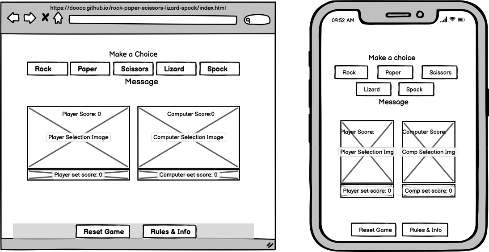
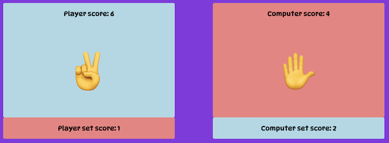

[View the live project here, Rock Paper Scissors Lizard Spock] (https://dooco.github.io/rock-paper-scissors-lizard-spock/)

# Rock, Paper, Scissors, Lizard, Spock
This website forms part assignment for the Code Institute’s Full Stack Developer course - personal portfolio two. Using principles of javascript learned on the javascript essentials module this website was developed to demonstrate students knowledge and ability to implement javascript code in a simple game.
The website is designed to be responsive by using simple css paramaters.

# User Experience (UX)

## Strategy Plane

Website was created to showcase knowledge of HTML, CSS & JavaScript and to provide users with some fun in the form of an online Rock, Paper, Scissors, Lizard, Spock game created with JavaScript.

## User stories

### First Time Visitor Goals
As a First Time Visitor, I want to easily understand the main purpose of the game.
As a First Time Visitor, I want to be able to easily navigate the site to play the game.
As a First Time Visitor, I want to be able to play game on any device.

### Returning Visitor Goals
As a Returning Visitor, I want to be able to play game at ease.
As a Returning Visitor, I want to compete with computer in simple game of chance.
As a Returning Visitor, I want to familiarise myself with rules of the game.

### Frequent User Goals
As a Frequent User, I want to continue to enjoy the game and share with family and friends.
As a Frequent User, I want to see if I can win against the computer.
As a Frequent User, I want to be able to reset game and start a new game.

# Design

## Colour Scheme
The three main colours used in the game are: blueviolet, lightblue and lightcoral.

## Typography
The DynaPuff font is the main font used throughout the website with cursive as the fallback font in case for any reason the font isn't being imported into the site correctly. DynaPuff is a quirky font used frequently in children's games / websites.

### Imagery
Simple emoji characters were used to represent the elements of the game. The heading of the game consists of the label the elements in text, followed by the emoji for that element.

Two display areas display player choice and score and the other display area the computer choice and score.

### Wireframes
Game Page Wireframe 

# Features
Responsive on all device sizes. 

Header

Player Selection 

Message and Reset Game

Player and Computer Image Selection and Score

Rules

Buttons with the names of the elements were used for player to select choice for game. When user’s mouse hovered over button the button animation (expands to 120%) shows which button is selected.

## Technologies Used
### Languages Used
HTML5
CSS3
JavaScript

### Frameworks, Libraries & Programs Used

Hover.css:
Hover.css was used on the Player selection buttons in the player choice selection area to enlarge button while being hovered over.
Google Fonts:
Google fonts were used to import the 'DynaPuff' font into the header section of index.html which is used throughout the project by referencing font family in style.css file.
Font Awesome:
Font Awesome was used in the game to add an icon for game reset.
Git
Git was used for version control by utilizing the Gitpod terminal to commit to Git and Push to GitHub.
GitHub:
GitHub is used to store the projects code after being pushed from Git.

Balsamiq:
Balsamiq was used to create the wireframes during the design process.

Code Institute's Student template for gitpod.

## Testing
The W3C Markup Validator and W3C CSS Validator Services were used to validate every page of the project to ensure there were no syntax errors in the project.

W3C Markup Validator - Results
W3C CSS Validator - Results
### Testing User Stories from User Experience (UX) Section

### Further Testing
The Website was tested on Google Chrome, Internet Explorer, Microsoft Edge and Safari browsers.
The website was viewed on a variety of devices such as Desktop, Laptop, iPhone7, iPhone 8 & iPhoneX.
A large amount of testing was done to ensure that all pages were linking correctly.
Friends and family members were asked to review the site and documentation to point out any bugs and/or user experience issues.
## Known Bugs
On some mobile devices the Hero Image pushes the size of screen out more than any of the other content on the page.
A white gap can be seen to the right of the footer and navigation bar as a result.
On Microsoft Edge and Internet Explorer Browsers, all links in Navbar are pushed upwards when hovering over them.
# Deployment
## GitHub Pages
The project was deployed to GitHub Pages using the following steps...

Log in to GitHub and locate the GitHub Repository
At the top of the Repository (not top of page), locate the "Settings" Button on the menu.
Scroll down the Settings page until you locate the "GitHub Pages" Section.
Under "Source", click the dropdown called "None" and select "Master Branch".
The page will automatically refresh.
Scroll back down through the page to locate the now published site link in the "GitHub Pages" section.

# Credits
## Code
The html, css and javascript code was copied from Code Institute's Portfolio Project 2 Scope video, modified and expanded to fit five elements of game Rock, Paper, Scissors, Lizard, Spock.

Javascript hash table: https://stackoverflow.com/questions/22623331/rock-paper-scissors-lizard-spock-in-javascript

## Content
All content was written by the developer.

Psychological properties of colours text in the README.md

## Media
All Images were created by the developer.
## Acknowledgements
My Mentor for continuous helpful feedback.

Tutor support at Code Institute for their support.

